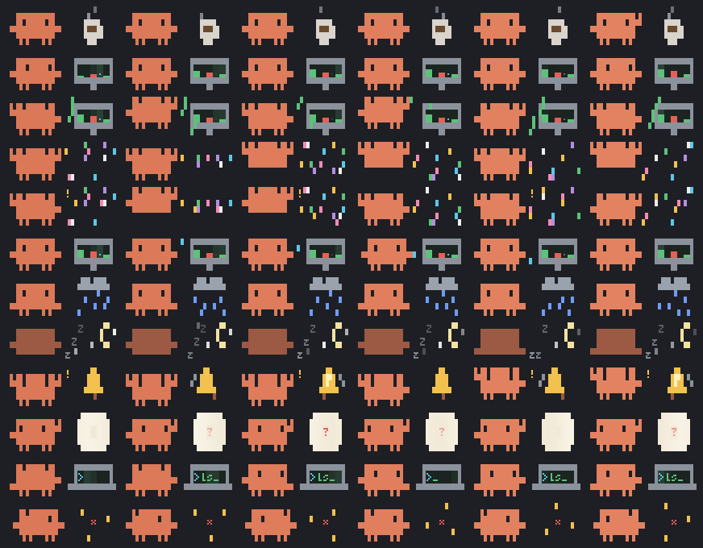
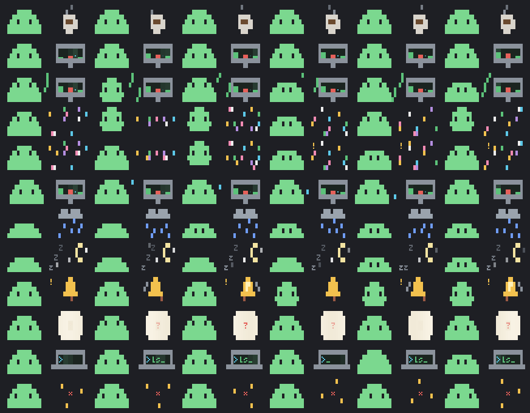

# cc-clawd

**Pixel pets for [Claude Code](https://claude.com/claude-code).** Clawd, the Claude Code crab, lives at the left of the band above your prompt, animates at 60 Hz, and knows what Claude is doing: it types on a laptop while Claude works, holds up a ticket when a permission prompt is waiting for you, sips coffee when nothing is happening, and falls asleep late at night. Other mods can tell it what to do, give it rows to show beside it, or give it a different body.



<sub>One row per state, top to bottom: idle, calm, happy, ecstatic, cheer, worried, sad, sleep, alert, needs, think, dizzy. Rendered with `tools/preview.mjs`.</sub>

> Clawd is Anthropic's Claude Code mascot. This is fan art and an unofficial project, not affiliated with or endorsed by Anthropic.

[中文说明](README.zh-CN.md)

## Install

```sh
claude plugin marketplace add yushiran/cc-clawd
claude plugin install clawd@cc-clawd
```

Then run `/reload-plugins` (or restart Claude Code). Requires a Claude Code build with function-hook mods (2.1.289 or later).

## What it does

| When | The pet |
|---|---|
| A permission prompt waits for you | holds up a ticket with a blinking `?` (highest priority) |
| Claude is working | types on a laptop whose screen shows what the tool does: `>ls_` for Bash, `[==]` for Read, `+-~` for Edit |
| Nothing is happening | sips coffee, looks around, stretches, blinks |
| Quiet for 20 minutes, or 3 minutes after midnight | sleeps under the moon |
| A mod or program sends a signal | whatever the signal says: a monitor of your numbers, confetti, rain, a bell |
| You click it (desktop app, or `renderer: client`) | a heart, a jump, a sparkle; its eyes follow the pointer |

`/clawd` shows what it is doing and why, and the frame rate. `/clawd demo` plays every state. `/clawd pets` lists the pets, and `/clawd pet slime` switches to one. `/clawd bench` measures each terminal renderer for four seconds.

Settings are under `/config` → clawd:
- **pet**: `clawd`, `slime`, or a pet of your own.
- **renderer**: `auto` picks one per surface; see below.
- **fps**: 30, 60 or 120 frames per second.

## How it draws

| Surface | Renderer | What you get |
|---|---|---|
| Terminal (most) | `raster` | Character pixels: quadrant blocks give each cell 2×2 pixels, repainted in place by `$.ui.blit` |
| kitty, Ghostty | `image` | Real pixels through the terminal's graphics protocol. Detected automatically, and the result is remembered per terminal |
| Desktop app | `client` | A surface module that animates on the app's own frame clock and reacts to the pointer |
| VS Code, mobile | `text` | The current frame as coloured text, redrawn when the pet's state changes |

A frame is computed every 1000/fps ms and sent only when it changed. Computing one takes about 10 µs, under 0.1% of a 60 Hz frame. While Claude works, about 35 of the 60 frames each second actually change. [docs/ENGINE.md](docs/ENGINE.md) has the measurements and the best practices behind them.

## For mod authors: `$.clawd`

cc-clawd adds `$.clawd` to every plugin's `$`, with no dependency to declare. Call it inside `try`/`catch`, and draw your own UI when it throws (the pet is not installed):

```js
try {
  const { columns } = await $.clawd.layout()      // lay your row out to this width
  await $.clawd.slot({ source: 'build', rows: [[['build ', { dim: true }], ['passing', { color: 'green' }]]], action: { label: 'log', command: 'build log' } })
  await $.clawd.signal({ source: 'build', scene: 'confetti', say: 'all green', priority: 80, ttlMs: 20000 })
  await $.clawd.emote({ emote: 'heart' })
} catch {
  // no pet: draw the band yourself
}
```

| Method | What it does |
|---|---|
| `signal({ source, scene, mood?, bars?, tool?, say?, priority?, ttlMs? })` | Puts the pet in a scene. The highest priority wins, ties go to the newest, and `scene: null` withdraws the signal |
| `emote({ emote, say? })` | A one-shot reaction over whatever it is doing: `heart`, `sparkle`, `surprise`, `question`, `jump`, `nod`, `shake` |
| `slot({ source, rows, order?, action? })` | Your rows in the band, to the right of the pet, with an optional button that runs a slash command |
| `pack(def)` | Registers a pet (a data pack) for the session |
| `layout()` / `state()` / `pets()` | Width for your rows, what the pet is doing, which pets exist |

The full reference is [docs/API.md](docs/API.md), the types are in [`plugins/clawd/types/index.d.ts`](plugins/clawd/types/index.d.ts), and [`examples/focus-timer`](examples/focus-timer) is a complete guest mod in about 50 lines.

## For any program: signal files

Scripts, cron jobs and training runs on a cluster can signal the pet without being a mod. Write a JSON file to `~/.local/share/clawd/signals/`:

```sh
d=~/.local/share/clawd/signals; mkdir -p $d
printf '{"scene":"confetti","say":"training finished","priority":85,"ttlMs":30000}' > $d/.train.tmp && mv $d/.train.tmp $d/train.json
```

The pet reads the folder every second. Deleting the file withdraws the signal.

## Make your own pet

A pet is a **pack**: plain JSON that holds a palette, character-art sprites and, for each state, a loop of frames plus props from the shared effects. Put it in `~/.config/clawd/pets/<id>.json` and run `/clawd pet <id>`.

```json
{
  "format": "cc-clawd/pack@1", "id": "blob", "cols": 17, "rows": 3, "mode": "quad",
  "palette": { "#": "#7bd88f" },
  "at": [1, 1],
  "sprites": { "a": ["..####..", ".##..##.", "########"], "b": ["........", "..####..", "########"] },
  "states": { "idle": { "frames": [["a", 900], ["b", 200]], "fx": [["coffee", 18, 0]] } }
}
```

States the pack lacks fall back toward `idle`. The built-in slime ([`examples/pets/my-slime.json`](examples/pets/my-slime.json)) is a full example:



Preview a pack in a plain terminal, render a contact sheet, or check it:

```sh
node tools/preview.mjs examples/pets/my-slime.json
node tools/preview.mjs examples/pets/my-slime.json --png sheet.png
node tools/preview.mjs --check my-pet.json
```

[docs/PACKS.md](docs/PACKS.md) is the format: modes, sprites, frames, the effects and their sizes, fallbacks, and how to make a built-in.

## Develop

```sh
claude plugin validate plugins/clawd
claude plugin test plugins/clawd          # the engine, the brain, and the host end to end on every surface
node tools/preview.mjs                    # every state of Clawd in this terminal
```

The layout:

| Path | What it is |
|---|---|
| `plugins/clawd/engine/pixel.js` | Canvas and encoders (Raster cells, text spans, RGBA) |
| `plugins/clawd/engine/fx.js` | Props and effects |
| `plugins/clawd/engine/pack.js` | Pack compiler and stage |
| `plugins/clawd/engine/brain.js` | What the pet does: priorities, signals, emotes, sleep |
| `plugins/clawd/hooks/register.js` | The host: Claude Code events, `$.clawd`, the band, renderers |
| `plugins/clawd/hooks/client.js` | The surface-side renderer |
| `plugins/clawd/pets/` | Built-in pets |

The engine is pure JavaScript with no dependencies, so the same files run in a hooks module, a client module and Node.

## License

[MIT](LICENSE) for the code. Clawd's design belongs to Anthropic.
